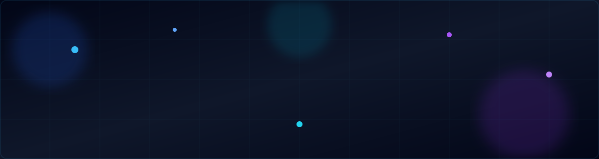

<div align="center">



<br>


<br>

<p>


</p>

<br>

<!-- Contact -->

<a href="https://www.linkedin.com/in/senthurkanthan-s-s-653a66195/" target="_blank">

</a>

<a href="mailto:senthursai66@gmail.com">

</a>

</div>
## 🧑‍💻 `whoami`

```bash
$ whoami

Senthurkanthan

$ role

DevOps / Linux Engineer

$ focus

Linux • AWS • Server Administration
Application Deployment • Production Support
```

I'm a **DevOps / Linux Engineer** focused on Linux server administration, AWS EC2, application deployment, Nginx configuration, SSL, databases and production troubleshooting.

I enjoy working close to the infrastructure and solving real-world deployment and server problems.

---

## ⚡ `tech_stack`

### ☁️ Cloud

<p>

</p>

### 🐧 OS & Servers

<p>

</p>

### 🚀 Application

<p>

</p>

### 🗄️ Database

<p>

</p>

### 🔧 Tools

<p>

</p>

---

## 🖥️ `server_status`

```text
┌──────────────────────────────────────────────┐
│              PRODUCTION STACK                │
├──────────────────────────────────────────────┤
│                                              │
│  🟢 Linux              ONLINE                │
│  🟢 Nginx              ONLINE                │
│  🟢 Node.js            ONLINE                │
│  🟢 PHP-FPM            ONLINE                │
│  🟢 PM2                ONLINE                │
│  🟢 MySQL              ONLINE                │
│  🟢 MongoDB            ONLINE                │
│                                              │
└──────────────────────────────────────────────┘
```

---

## 🚀 `projects`

```text
📂 ~/projects

├── ☁️ aws-server-deployment
│   └── AWS EC2 + Linux + Nginx
│
├── 🚀 nodejs-production-deployment
│   └── Node.js + PM2 + Nginx + SSL
│
├── 🐘 laravel-production-deployment
│   └── PHP + Laravel + Nginx + MySQL
│
├── 🐧 linux-server-administration
│   └── Linux + Bash + Nginx
│
├── 📊 server-monitoring
│   └── Linux + Bash + Monitoring
│
└── ⚙️ devops-automation
    └── Bash + Git + Automation
```

> 🚧 More production-focused projects are being added.

---

## 🔄 `deployment_pipeline`

```text
       👨‍💻 CODE
          │
          ▼
      🔀 GIT / GITHUB
          │
          ▼
      ⚙️ BUILD
          │
          ▼
      🚀 DEPLOY
          │
          ▼
      🌐 NGINX
          │
          ▼
    🖥️ APPLICATION
          │
          ▼
      📊 MONITOR
          │
          ▼
     🔧 IMPROVE
```

---

## 📚 `currently_learning`

<p align="center">


</p>

---

## 🎯 `career_focus`

```yaml
target:
  - DevOps Engineer
  - Linux Engineer
  - Cloud / AWS Engineer
  - Site Reliability Engineer

interests:
  - Linux
  - AWS
  - Cloud Infrastructure
  - Application Deployment
  - Automation
  - Monitoring
```

---

## 📫 `connect`

<div align="center">

<a href="https://github.com/Senthurkanthan">

</a>

<a href="https://www.linkedin.com/in/senthurkanthan-s-s-653a66195">

</a>

</div>

<br>

<div align="center">

```bash
$ echo "Building reliable systems, one deployment at a time."
```

### `⚡ Learn • Build • Deploy • Monitor • Improve`

</div>
